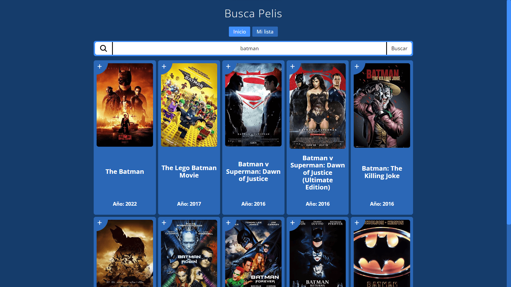

# Busca Pelis

Un buscador de películas creada en ReactJS.

## Por qué lo hice

En este mundo de la programación React hay que aprenderlo si o si, y para poder aprenderlo lo mejor es ponerse un reto que al principio no tienes ni idea de cómo empezarlo.

Me llevó literalmente meses y muchos intentos para poder ser capaz de entender la **lógica** que hay detrás de una simple web que tenga un carrito de la compra.

En vez de eso quise darle la vuelta y hacer un buscador de películas en la que puedas guardar las películas que quisieras en una lista y mostrarlo al usuario.

Me di cuenta que para hacer una tienda con un carrito de la compra y guardar películas en una lista es muy parecido o prácticamente igual en la lógica de la aplicación.

En la parte de _**Documentación**_ de este readme dejo los distintos tipos de medios que usé para poder aprender ha hacer este tipo de proyecto y comprender su lógica.

## Lo que aprendí:

Es el primer proyecto que realicé con la librería [React](https://react.dev) con el que aprendí a usar **contexts**, **states**, **providers**, **reducers**, **custom hooks**, **renderización condicional**, inputs **controlados** y **no controlados**.

También aprendí a usar el paquete [React Router DOM](https://reactrouter.com) y [Wouter](https://github.com/molefrog/wouter) de forma muy básica pero funcional para manejar rutas.

Ayudó mucho este proyecto para interiorizar mejor los conocimientos en **JavaScript** como el manejo de objetos, métodos para manipular arreglos, y fetching de datos.

## Cómo usarlo

Tan fácil como escribir en el campo de búsqueda la película deseada en **inglés** ya que se usa una [API](https://omdbapi.com) que solo maneja búsquedas en ese idioma.

Se puede guardar películas en el almacenamiento local del navegador pulsando en el símbolo **+** para añadir esa película a la lista o para eliminarla si está ya añadida.

En _**Mi lista**_ se puede consultar las películas guardadas.

## Tecnologías Usadas

## Vista

## Documentación

### Vídeos

|            Nombre            |                            Vídeo                             |
| :--------------------------: | :----------------------------------------------------------: |
|   Prueba técnica en React    | [https://youtu.be/GOEiMwDJ3lc](https://youtu.be/GOEiMwDJ3lc) |
|       Tienda y carrito       | [https://youtu.be/B9tDYAZZxcE](https://youtu.be/B9tDYAZZxcE) |
| React Router en Github Pages | [https://youtu.be/NZ_2rWgjias](https://youtu.be/NZ_2rWgjias) |

### Info

|    Nombre    |                                   Info                                   |
| :----------: | :----------------------------------------------------------------------: |
|     Vite     |                [https://vitejs.dev/](https://vitejs.dev/)                |
|    React     |                  [https://react.dev](https://react.dev)                  |
|    Wouter    | [https://github.com/molefrog/wouter](https://github.com/molefrog/wouter) |
| React Router |           [https://reactrouter.com/](https://reactrouter.com/)           |
